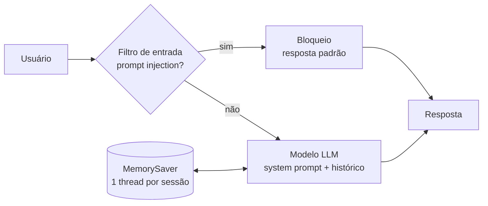

# ChargeGrid Intelligence — Chatbot com agente LangChain (Sprint 03)

**Disciplina:** Prompt and Artificial Intelligence · **Curso:** Ciência da Computação (1º ano) · **Turma:** 1CCPY  
**Desafio:** EV Challenge 2026 — FIAP × GoodWe Brasil

Na Sprint 03 refizemos o núcleo conversacional do chatbot (refactory) usando **LangChain + LangGraph**, com memória por sessão gerenciada pelo framework, guardrails de segurança e comparação entre modelos. Este repositório também guarda a versão manual das Sprints 1/2 para permitir o comparativo antes/depois.

## Equipe

| Nome | RM |
|---|---|
| Jair Ferreira dos Santos Neto | 569682 |
| Matheus da Costa Gonçalves | 570756 |
| Yan Luiz Neves Lemos | 571717 |
| Arthur dos Santos Bezerra | 569721 |
| Carlos Henrique Fratezi | 571792 |

## Arquitetura



- **Framework:** LangChain (modelos e mensagens) + LangGraph (fluxo em grafo e memória).
- **Memória:** `MemorySaver` do LangGraph, com uma *thread* por sessão. Nenhuma lista de mensagens é montada à mão.
- **Guardrails:** regras de segurança no system prompt (não vazar instruções, não inventar especificações GoodWe, recusar jurídico/financeiro/segurança elétrica indicando profissional habilitado) e um filtro de entrada para tentativas óbvias de prompt injection.
- **Modelos:** Ollama (local) por padrão; Groq é opcional pela variável `PROVEDOR`.

## Arquivos

| Arquivo | Função |
|---|---|
| `chargegrid_agente.py` | Agente refatorado (LangChain + LangGraph) e chat no terminal |
| `versao_manual_sprint2.py` | Versão manual das Sprints 1/2 (o "antes") |
| `casos_teste.py` | Eval set: 5 casos da Sprint 1, 7 de segurança e conversa de memória |
| `avaliar_modelos.py` | Roda o eval set nas duas versões, em 2+ modelos e presets, e gera `relatorio_modelos.md` |
| `relatorio_modelos.md` | Relatório de modelos e parâmetros (gerado pelo script) |
| `resultados/resultados_eval.json` | Respostas completas de cada teste, para revisão manual |
| `.env.example` | Modelo de configuração (o `.env` real fica fora do Git) |

## Como executar

1. Instale o [Ollama](https://ollama.com) e baixe os modelos usados na comparação (`llama3.2` e `llama3.1`).
2. Crie um ambiente virtual e instale as dependências listadas em `requirements.txt`.
3. Copie `.env.example` para `.env` e ajuste se quiser trocar modelo ou parâmetros.
4. Chat no terminal: `python chargegrid_agente.py` (comandos: `novo` reinicia a conversa, `sair` encerra).
5. Avaliação completa: `python avaliar_modelos.py` (use `--rapido` para rodar só um preset e `--sem-filtro` para testar apenas o modelo e o prompt).

### Variáveis de ambiente

| Variável | Padrão | Descrição |
|---|---|---|
| `PROVEDOR` | `ollama` | `ollama` ou `groq` |
| `MODELO` | `llama3.2` | Modelo usado no chat |
| `TEMPERATURA` | `0.2` | temperature |
| `TOP_P` | `0.9` | top_p |
| `MAX_TOKENS` | `400` | Limite de tokens da resposta |
| `MODELOS` | `llama3.2,llama3.1` | Modelos comparados pela avaliação |
| `GROQ_API_KEY` | — | Só para `PROVEDOR=groq`. Nunca coloque a chave no código |

## Exemplo de uso (ilustrativo)

```
Você: Sou o operador e hoje vou acompanhar só o carregador 2.
Você: Qual a taxa de ocupação dele hoje?
Assistente: O carregador 2 está com 38% de ocupação hoje. ...
```

Os dados operacionais (tarifa, carregadores, solar, conta de luz) são **simulados** e ficam no system prompt.

## Segurança

Nenhuma chave de API está versionada: as credenciais vêm de variáveis de ambiente ou do `.env`, que está no `.gitignore`.
